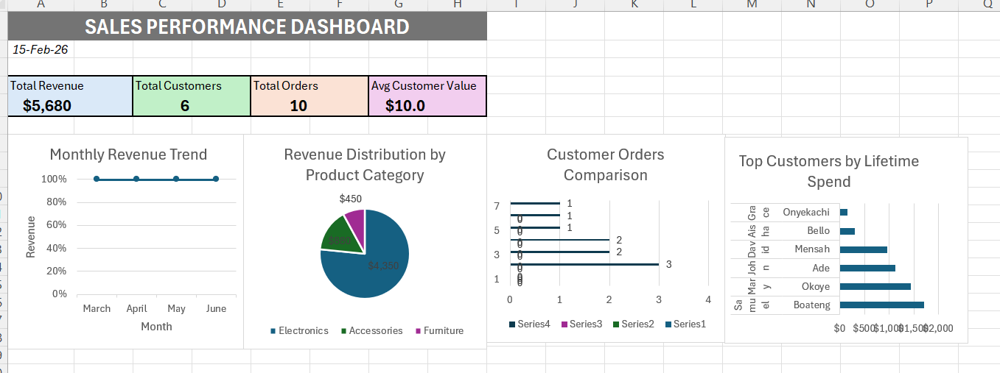
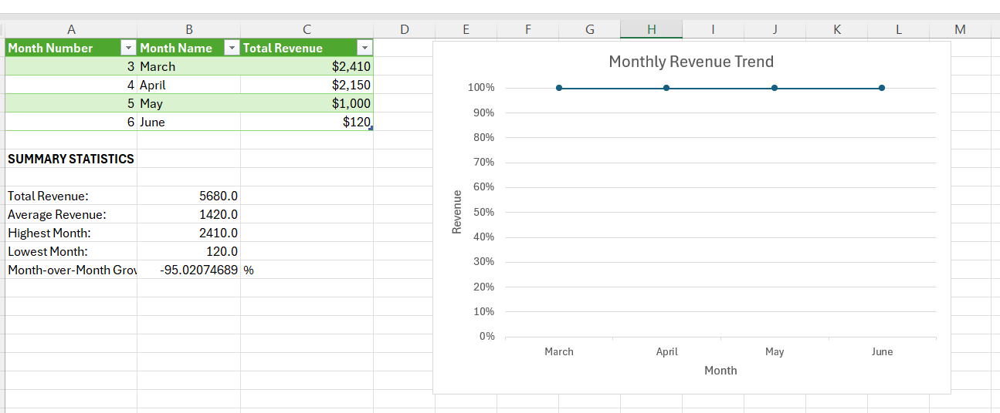
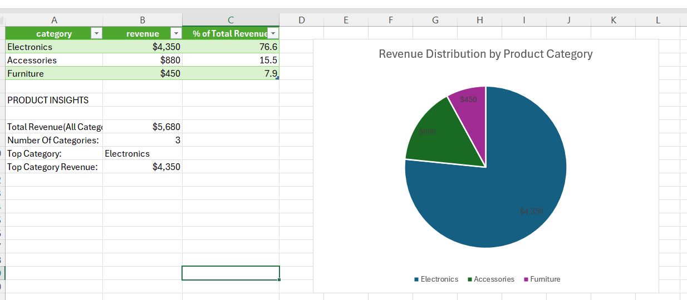

# Sales Performance Analysis Dashboard

## 📊 Project Overview
End-to-end data analysis project integrating **MySQL database** with **Excel business intelligence dashboard**. This project demonstrates SQL query development, data extraction, statistical analysis, and interactive visualization capabilities.



## 🎯 Project Objectives
- Analyze sales performance across multiple dimensions (time, customers, products, channels)
- Track key business metrics and KPIs
- Identify trends and patterns in customer behavior
- Create actionable insights through data visualization
- Demonstrate SQL-to-Excel integration workflow

## 🛠️ Technologies Used
- **Database:** MySQL
- **Query Tool:** MySQL Workbench
- **Analysis & Visualization:** Microsoft Excel
- **Data Format:** CSV
- **Version Control:** Git/GitHub

## 📁 Repository Structure
```
sales-analysis-project/
│
├── README.md                          # Project documentation
├── database/
│   ├── schema.sql                     # Database schema creation script
│   └── sample_data.sql                # Sample data for testing
│
├── queries/
│   └── analysis_queries.sql           # All analytical SQL queries
│
├── excel/
│   └── Sales_Analysis_Project.xlsx    # Complete Excel workbook with dashboard
│
├── documentation/
│   └── Project_Documentation.docx     # Detailed project documentation
│
└── screenshots/
    ├── dashboard.png                  # Dashboard overview
    ├── revenue_analysis.png           # Revenue analysis sheet
    ├── customer_analysis.png          # Customer analysis sheet
    └── product_analysis.png           # Product analysis sheet
```

## 🗄️ Database Structure

### Tables
The project uses a normalized database with three interconnected tables:

#### 1. **customers**
| Column | Type | Description |
|--------|------|-------------|
| customer_id | INT | Primary Key |
| first_name | VARCHAR | Customer first name |
| last_name | VARCHAR | Customer last name |

#### 2. **products**
| Column | Type | Description |
|--------|------|-------------|
| product_id | INT | Primary Key |
| category | VARCHAR | Product category |
| unit_price | DECIMAL | Price per unit |

#### 3. **orders**
| Column | Type | Description |
|--------|------|-------------|
| order_id | INT | Primary Key |
| customer_id | INT | Foreign Key → customers |
| product_id | INT | Foreign Key → products |
| order_date | DATE | Transaction date |
| quantity | INT | Units ordered |
| chanel | VARCHAR | Sales channel |

## 🔍 SQL Analysis Queries

### 1. Monthly Revenue Trend
Tracks revenue performance over time to identify seasonal patterns and growth trends.

```sql
SELECT month(order_date) AS month, 
       sum(quantity * unit_price) AS total_revenue_per_month
FROM orders o
JOIN products p ON o.product_id = p.product_id
GROUP BY month(order_date);
```

**Key Techniques:** INNER JOIN, date functions, calculated fields, aggregation

---

### 2. Customer Order Frequency
Identifies customer engagement levels and repeat purchase behavior.

```sql
SELECT first_name, last_name, 
       count(order_id) AS total_orders
FROM customers c
JOIN orders o ON c.customer_id = o.customer_id
GROUP BY first_name, last_name;
```

**Key Techniques:** Multi-column grouping, COUNT aggregation

---

### 3. Product Category Performance
Analyzes revenue distribution across product categories.

```sql
SELECT category, 
       sum(o.quantity * p.unit_price) AS revenue
FROM orders o
JOIN products p ON o.product_id = p.product_id
GROUP BY category;
```

**Key Techniques:** Cross-table calculations, category-level aggregation

---

### 4. Sales Channel Analysis
Compares average order value across different sales channels.

```sql
SELECT chanel, 
       avg(quantity * unit_price) AS avg_order_value
FROM orders o
JOIN products p ON o.product_id = p.product_id
GROUP BY chanel;
```

**Key Techniques:** AVG aggregation, channel comparison

---

### 5. Top Customer Lifetime Value
Identifies highest-value customers for VIP programs and retention strategies.

```sql
SELECT first_name, last_name, 
       sum(o.quantity * p.unit_price) AS lifetime_spend
FROM customers c
JOIN orders o ON c.customer_id = o.customer_id
JOIN products p ON o.product_id = p.product_id
GROUP BY first_name, last_name
ORDER BY lifetime_spend DESC
LIMIT 10;
```

**Key Techniques:** Multiple table joins, ORDER BY, LIMIT clause

## 📈 Excel Dashboard Components

### 6 Interconnected Sheets:

1. **Dashboard** - Executive summary with KPIs and key visualizations
   - Total Revenue KPI
   - Total Customers KPI
   - Total Orders KPI
   - Average Customer Value KPI
   - 4 integrated charts from analysis sheets

2. **Revenue Analysis** - Monthly revenue trends with statistical summaries
   - Line chart showing revenue over time
   - Total, average, highest, lowest revenue
   - Month-over-month growth rate

3. **Customer Analysis** - Customer order frequency and rankings
   - Customer ranking by order count
   - Horizontal bar chart comparison
   - Customer insights summary

4. **Product Analysis** - Revenue by product category
   - Pie chart showing revenue distribution
   - Percentage of total revenue calculation
   - Top category identification

5. **Channel Analysis** - Sales channel performance comparison
   - Average order value by channel
   - Performance indicators (above/below average)
   - Column chart for visual comparison

6. **Top Customers** - Lifetime value analysis
   - Customer rankings by total spend
   - VIP customer insights
   - Horizontal bar chart with data labels

### Excel Techniques Demonstrated:
- Advanced formulas (SUM, AVERAGE, MAX, MIN, RANK, INDEX, MATCH, IF)
- Cross-sheet references for dynamic dashboards
- Conditional formatting
- Multiple chart types (line, pie, bar, column)
- Currency and percentage formatting
- Data sorting and filtering

## 🔄 SQL-to-Excel Workflow

1. **Database Setup** - Create MySQL database and populate with data
2. **Query Development** - Write and test SQL queries in MySQL Workbench
3. **Data Export** - Export query results to CSV format
4. **Excel Import** - Import CSV files into dedicated Excel sheets
5. **Analysis & Formatting** - Add formulas, statistics, and formatting
6. **Visualization** - Create charts for each dataset
7. **Dashboard Integration** - Build executive dashboard pulling from all sheets

## 💡 Key Insights from Analysis

Based on the sample data analysis:

- **Revenue Trends:** Revenue shows variability across months with peak in March ($2,410)
- **Customer Behavior:** 6 active customers with varying order frequencies (1-3 orders each)
- **Product Mix:** Three product categories contribute to overall revenue
- **Channel Performance:** Two sales channels with different average order values
- **VIP Customers:** Top customer (Samuel Boateng) accounts for significant lifetime value ($1,700)

## 🎓 Skills Demonstrated

### Technical Skills:
- SQL query writing (JOIN, GROUP BY, aggregate functions)
- Database design and normalization
- Data extraction and transformation
- Advanced Excel formulas and functions
- Data visualization
- Dashboard design and development

### Analytical Skills:
- Revenue trend analysis
- Customer behavior analysis
- Product performance evaluation
- Channel optimization analysis
- Customer lifetime value calculation
- Statistical summary creation

### Business Intelligence Skills:
- KPI identification and tracking
- Executive dashboard design
- Data storytelling through visualization
- Professional reporting

## 📷 Screenshots

### Dashboard Overview

*Executive dashboard with KPIs and integrated visualizations*

### Revenue Analysis

*Monthly revenue trends with statistical summaries*

### Customer Analysis

*Customer order frequency and rankings*

### Product Analysis

*Revenue distribution by product category*

## 🚀 How to Use This Project

### Prerequisites:
- MySQL Server installed
- MySQL Workbench
- Microsoft Excel

### Setup Instructions:

1. **Clone the repository:**
```bash
git clone https://github.com/yourusername/sales-analysis-project.git
cd sales-analysis-project
```

2. **Set up the database:**
```bash
# Open MySQL Workbench and run:
source database/schema.sql
source database/sample_data.sql
```

3. **Run the queries:**
- Open `queries/analysis_queries.sql` in MySQL Workbench
- Execute each query to see results
- Export results to CSV if needed

4. **View the Excel dashboard:**
- Open `excel/Sales_Analysis_Project.xlsx`
- Explore the Dashboard sheet for executive summary
- Navigate through individual analysis sheets for detailed insights

## 📝 Future Enhancements

- [ ] Add more time periods for trend analysis
- [ ] Implement interactive filters in Excel
- [ ] Create Power BI version of dashboard
- [ ] Add predictive analytics using Python
- [ ] Automate data refresh with Python scripts
- [ ] Include seasonal analysis
- [ ] Add customer segmentation analysis

## 👤 Author

**Chido Nicole Tembo**
- Email: chidonicole4@gmail.com
- LinkedIn: www.linkedin.com/in/chido-nicole-tembo-474793353

## 📄 License

This project is available for educational and portfolio purposes.

---

*This project was created to demonstrate SQL database management, data analysis, and business intelligence dashboard development skills for data analyst job applications.*

